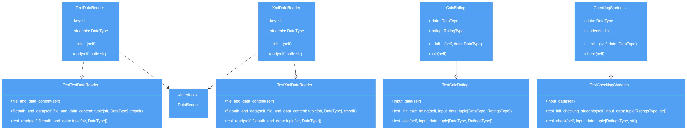

# Лабораторная работа 1 по дисциплине "Технологии программирования"

### Знакомство с системой контроля версий Git и инструментом CI/CD GitHub Actions

# Цели работы:
1. Познакомиться c распределенной системой контроля версий кода Git и ее функциями;
2. Познакомиться с понятиями «непрерывная интеграция» (CI) и «непрерывное развертывание»
(CD), определить их место в современной разработке программного обеспечения;
3. Получить навыки разработки ООП-программ и написания модульных тестов к ним на
современных языках программирования;
4. Получить навыки работы с системой Git для хранения и управления версиями ПО;
5. Получить навыки управления автоматизированным тестированием программного обеспечения,
расположенного в системе Git, с помощью инструмента GitHub Actions.

# Постановка задачи:
В качестве примера в лабораторной работе используется проект, рассчитывающий средний
рейтинг студентов по дисциплинам. Список студентов и полученных ими оценок приводится в
текстовом файле.

Необходимо добавить в проект еще один класс – наследник класса ***DataReader***, который должен
обрабатывать входной файл формата *XML*. Составить модульные тесты для методов этого класса.

Необходимо добавить в проект класс, реализующий расчет определенных характеристик студентов:

    Определить и вывести на экран студента, имеющего 100 баллов по всем дисциплинам. Если таких студентов
    несколько, нужно вывести любого из них. Если таких студентов нет, необходимо вывести сообщение 
    об их отсутствии.

Составить модульные тесты для методов этого класса.

Составить UML-диаграмму классов итогового проекта.

# Краткое описание проекта
- Файл *data/data.xml* содержит информацию о студентах и их оценках
- Представленный в файле *src/XmlDataReader.py* класс реализует чтение данных из
текстовых файлов формата *.xml*:
```python
class XmlDataReader(DataReader):

    def __init__(self) -> None:
        self.key: str = ""
        self.students: DataType = {}

    def read(self, path: str) -> DataType:
        tree = ET.parse(path)
        root = tree.getroot()
        i = 0
        for elem in root:
            self.key = elem.attrib.get('name')
            self.students[self.key] = []
            for j in range(len(root[i])):
                subj = root[i][j].tag
                score = root[i][j].text
                self.students[self.key].append((subj, int(score)))
            i += 1
        return self.students
```
- Сам поиск студента, имеющего 100 баллов по всем дисциплинам осуществляется с помощью программного кода, представленного в
файле *src/CheckingStudents.py*:
```python
class CheckingStudents:

    def __init__(self, data: DataType) -> None:
        self.data: DataType = data
        self.students: dict = []

    def check(self) -> str:
        number = 0
        for name in self.data:
            if self.data[name] == 100:
                self.students.insert(number, name)
        if len(self.students) == 0:
            return 0
        else:
            random_index = random.randint(0, len(self.students) - 1)
            return str(self.students[random_index])
```
- Файл *test/test_CheckingStudents.py* содержит класс для выполнения модульного тестирования
методов класса *CheckingStudents*:
```python
class TestCheckingStudents:

    @pytest.fixture()
    def input_data(self) -> tuple[RatingsType, str]:
        data: RatingsType = {
            "Абрамов Петр Сергеевич": 100,
            "Петров Игорь Владимирович": 79
        }

        student: str = "Абрамов Петр Сергеевич"

        return data, student

    def test_init_checking_students(self, input_data: tuple[RatingsType, str])\
            -> None:

        checking_students = CheckingStudents(input_data[0])
        assert input_data[0] == checking_students.data

    def test_check(self, input_data: tuple[RatingsType, str]) -> None:

        stud = CheckingStudents(input_data[0]).check()
        assert pytest.approx(stud) == input_data[1]
```
- Тестирование класса *XmlDataReader* осуществляется с помощью класса, реализованного в
файле *test/test_XmlDataReader.py*:
```python
class TestXmlDataReader:

    @pytest.fixture()
    def file_and_data_content(self) -> tuple[str, DataType]:
        text = "<?xml version=\"1.0\" encoding=\"UTF-8\" ?>\n" + \
               "<root>\n" + \
               "    <person name=\"Иванов Иван Иванович\">\n" + \
               "        <математика>67</математика>\n" + \
               "        <литература>100</литература>\n" + \
               "        <программирование>91</программирование>\n" + \
               "    </person>\n" + \
               "    <person name=\"Петров Петр Петрович\">\n" + \
               "        <математика>78</математика>\n" + \
               "        <химия>87</химия>\n" + \
               "        <социология>61</социология>\n" + \
               "    </person>\n" + \
               "</root>\n"

        data = {
            "Иванов Иван Иванович": [
                ("математика", 67), ("литература", 100),
                ("программирование", 91)
            ],
            "Петров Петр Петрович": [
                ('математика', 78), ('химия', 87), ('социология', 61)
            ]
        }
        return text, data

    @pytest.fixture()
    def filepath_and_data(self,
                          file_and_data_content: tuple[str, DataType],
                          tmpdir) -> tuple[str, DataType]:
        p = tmpdir.mkdir("datadir").join("my_data.xml")
        p.write_text(file_and_data_content[0], encoding='utf-8')
        return str(p), file_and_data_content[1]

    def test_read(self, filepath_and_data: tuple[str, DataType]) -> None:
        file_content = XmlDataReader().read(filepath_and_data[0])
        assert file_content == filepath_and_data[1]
```

# Используемые языки / библиотеки / технологии
Языки: Python

Библиотеки: ElementTree, random

Технологии: Git, GitHub Actions

# UML-диаграмма


# Выводы по работе
В данной работе я познакомился с GitHub и GitHub Actions. Получил навыки разработки ООП-программ и написания модульных
тестов к ним. Получил навыки управления автоматизированным тестированием программного обеспечения, расположенного в 
системе Git, с помощью инструмента GitHub Actions.